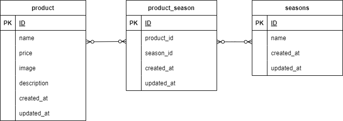

## アプリケーション名
お問い合わせ

## 環境構築
```
Dockerビルド
1.git clone <リポジトリURL>
2.dockerコンテナを構築
$ docker-compose up -d --build
3.srcディレクトリにある「.env.example」をコピーして 「.env」を作成し DBの設定を変更　
$ cp .env.example .env
---
DB_HOST=XXX
DB_DATABASE=XXX
DB_USERNAME=XXX
DB_PASSWORD=XXX
---

Laravelをインストール
1docker-compose exec php bash
2 composer install

アプリケーションキーを作成
3 php artisan key:generate

DBのテーブルを作成
4 php artisan migrate

DBのテーブルにダミーデータを投入
5 php artisan db:seed

"The stream or file could not be opened"エラーが発生した場合
ディレクトリ/ファイルの権限を変更
6 sudo chmod -R 777 src/storage
```
## 使用技術
```
・PHP8.0
・laravel 10.0
・MySQL 8.0
```

## URL
```
・環境構築：http://localhost/
・phpMyAdmin:http://localhost:8080/
```

## ER図
